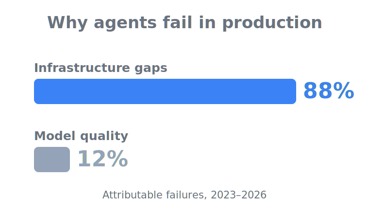

<h1 align="center">Agentic AI Production Readiness</h1>

  A curated, source-backed field guide for taking AI agents from a working demo to a production
  process you can <em>operate, defend, and pass an audit on</em>.

  
  

  <b>The demo was the easy part.</b> Running the thing in production — without it overspending,
  leaking, or failing an audit — is the part nobody hands you a playbook for. This is that playbook.

## Contents

- [Why this exists](#why-this-exists)
- [What this is — and isn't](#what-this-is--and-isnt)
- [How to use it](#how-to-use-it)
- [Structure](#structure)
  - [When to use agents](docs/when-to-use-agents/README.md)
  - [Limits & budgets](docs/limits-and-budgets/README.md)
  - [Guardrails & safety](docs/guardrails-and-safety/README.md)
  - [Observability & evals](docs/observability-and-evals/README.md)
  - [Human control & rollback](docs/human-control-and-rollback/README.md)
  - [Identity & access](docs/identity-and-access/README.md)
  - [Compliance & governance](docs/compliance-and-governance/README.md)
  - [Case studies](docs/case-studies/README.md)
  - [Checklists](checklists/)
  - [Risk register](risk-register/)
- [The compliance spine](#the-compliance-spine)
- [Contributing](#contributing)
- [How this was written](#how-this-was-written)
- [License](#license)

## Why this exists

I kept watching the same thing happen. An agent works beautifully in the demo, gets the green light,
goes live — and then breaks in a way that has nothing to do with how smart the model is. It loops and
burns a month's budget overnight. It calls a tool it should never have had access to. Something goes
wrong and there's no trace to explain *what*, no switch to stop it, no way back to the last good state.
Then a customer — or a regulator — asks a simple question: *prove you were in control.* And the team
that shipped it can't.

So I started reading incidents instead of marketing. Across documented agent failures from 2023–2026,
the same picture repeats: **the failures that can be attributed to a cause are overwhelmingly
infrastructure gaps — missing limits, guardrails, observability, identity boundaries, rollback paths —
not model quality.** In my own reading of the record it's roughly **88% of attributable failures**;
treat that as an order-of-magnitude claim, not a constant, but the *direction* is not in doubt. OWASP
ranks the top agent risks as **[excessive agency](https://genai.owasp.org/llmrisk/llm062025-excessive-agency/)**
(too much permission and autonomy) and **[unbounded consumption](https://genai.owasp.org/llmrisk/llm102025-unbounded-consumption/)**
(runaway cost, denial-of-wallet) — not accuracy. Anthropic frames agent reliability as a
**[context-engineering problem](https://www.anthropic.com/engineering/effective-context-engineering-for-ai-agents)**,
not a smarter-model problem. And reported AI incidents are climbing fast — a ballpark **233 in 2024,
up ~56% year-on-year** ([Stanford HAI AI Index 2025](https://hai.stanford.edu/ai-index/2025-ai-index-report/responsible-ai)).

  

That's the whole motivation: **you can already build the agent. The gap is hardening it for a real
production process — and producing the evidence that you're in control when someone asks.** This repo
collects what I've learned, read, and seen work, organised around exactly the infrastructure that,
when it's missing, is what actually breaks.

> One discipline runs through everything here: **every number is attached to a source, primary sources
> beat vendor blogs, and figures are treated as ballpark — never as constants.** If a claim loses its
> source, it loses its place.

## What this is — and isn't

This is a **curated knowledge collection** — mental models, risks, checklists, and decision aids,
organised around *what fails when it's missing*: the production infrastructure. It's a thinking aid
that helps you ask the right questions before go-live, and a living, source-backed document meant to
be argued with and improved as it's built out. It is deliberately **not** a framework, library, or
turnkey system to install; not a "build an agent in framework X" tutorial; and not an
"I-know-everything" oracle handing down the one correct answer. It's mid-build, on purpose.

Which means it's written for a specific reader: someone **accountable** for an agentic system that
actually has to run — reliably, within acceptable risk, where a mistake can't be waved away as "just
an experiment." The defining trait is that **they can already build an agent; the gap is hardening it
for production and surviving compliance and audit.** They didn't sign up to be an ops or compliance
officer, but they own the fallout — when it misbehaves, overspends, or fails an audit, it lands on
them. In practice that's the senior/staff engineer embedding an agent feature into a real product, the
AI/ML engineer taking a working PoC into an unattended workflow, the tech lead or architect signing
off on go-live, the product/platform/process owner wiring agents into processes that touch money and
records, the business owner judging whether an agentic approach is even sensible and economically
sound — or whether deterministic logic wins — and the consultant who needs defensible, evidence-based
go/no-go criteria.

It's **probably not for you** if you're a weekend-PoC tinkerer with no intent to run it for real, the
intern building a throwaway demo, a developer just trying out tools and orchestration for fun, a pure
researcher chasing benchmarks, or a team already operating a mature agent platform and looking for an
installable product. Those readers can still get value — but the hardening overhead here will get in
their way more than it helps. The focus stays squarely on the people who carry the consequences.

## How to use it

This is **not** a linear manual to read front to back. It's a structured collection of ideas, risks,
checklists, and decision aids — read the parts that match your role, your project phase, or the question
in front of you. Sometimes that's risk analysis, sometimes validation, sometimes governance, sometimes
the prior question of whether an agent is the right tool at all.

The point of the prose is to help you ask better questions before you ship:

- What do I need to think about *before* putting an agent into production?
- Which risks do I have to assess — and which assumptions must I validate?
- Where does my chosen approach hit its limits?
- Which governance and compliance questions are still open?
- Where do I want **deterministic logic** instead of agentic flexibility?
- Which checks belong in front of a deployment, and which failure modes are realistic?

The more hands-on material — checklists, risk templates, scoring aids — exists to translate those
conceptual questions into concrete work. Use it as a working surface, not a verdict.

And treat the whole thing as **alive**. Models, tools, regulation, and best practice all move fast, so
this is meant to be argued with: what actually works in practice, what's overrated, where the technical
ground has shifted, which risks got underestimated. Different experience, better approaches, new risks,
counter-examples — all welcome.
## Structure

The repository is organised as **seven pillars** plus a set of **cross-cutting artifacts**. The first
pillar is the decision *whether to use an agent at all*; the other six are the production
infrastructure that choice obligates. Each pillar is a chapter — an **overview hub** that maps the
topic and stands on its own, plus a handful of focused **deep-dive pages**, one per sub-topic. Every
number and claim is tied to a primary source, and each page closes with its own **Sources** list.

### The seven pillars

| Pillar | What it covers |
|--------|----------------|
| **[When to use agents](docs/when-to-use-agents/README.md)** | The decision that runs before the other six: agent vs. LLM-augmented workflow vs. plain deterministic code, picking the least-agentic option that does the job so you only pay the hardening bill on purpose. Deep-dives draw the workflow/agent line, name the few signals that genuinely earn an agent, price the token and reliability cost of agency, weigh multi-agent against single-agent, and mark the cases where classical code beats AI outright. Read it first — every rung of autonomy you add is infrastructure the rest of the repository then makes you build. |
| **[Limits & budgets](docs/limits-and-budgets/README.md)** | The off-switch the cloud bill depends on: token and cost ceilings, rate/loop/timeout caps, and a spend-rate circuit breaker that stand between a stuck agent and a five-figure invoice. Deep-dives cover per-run and per-day budgets with cost attribution, the loop and wall-clock caps that catch runaways, the denial-of-wallet attack class, and the caching and model right-sizing that lower what each legitimate run costs. The through-line: a limit only counts if it's enforced in deterministic code outside the model, never asked of the model in a prompt. |
| **[Guardrails & safety](docs/guardrails-and-safety/README.md)** | Defense-in-depth for a model that can be fooled, the pillar an attacker tests on day one. It starts from one rule: the model can't reliably tell data from instructions, so every tool result and retrieved document is untrusted and safety has to come from layers around the model. Deep-dives work through prompt-injection defense, input/output and tool-argument filtering, sandboxing and blast-radius containment, the memory- and tool-supply-chain attacks that arrive before the prompt — and how to *measure* injection defense rather than just claim it. |
| **[Observability & evals](docs/observability-and-evals/README.md)** | If you can't trace it and can't measure it, you can't operate it. This pillar answers *what did the agent actually do, and is it still good enough* — structured traces and per-run token accounting for a single run, regression suites and online evals for the whole population. Deep-dives cover the vendor-neutral trace tree (OpenTelemetry GenAI spans), offline eval suites that gate every change, eval-in-production and the single-shot-vs-reliable gap, and FinOps cost attribution per feature, tenant, and run. |
| **[Human control & rollback](docs/human-control-and-rollback/README.md)** | The off-switch, the undo, and the gate that actually holds: the controls that decide how bad an incident gets after it starts. They answer three questions an incident asks in order — can a human approve before it happens, stop it while it happens, and roll back to a known-good state after. Deep-dives build HITL approval gates that survive automation bias, staged rollout (shadow → canary → GA), the kill switch with four-layer versioned rollback, and the incident-response runbooks for when prevention ends. |
| **[Identity & access](docs/identity-and-access/README.md)** | An agent is a new non-human identity holding real credentials and real blast radius, so it should get only the keys the task needs. Deep-dives give each agent its own identity instead of a borrowed human session, build the tool-permission matrix that scopes every tool to a single least-privilege credential, keep secrets scoped, short-lived, and out of the prompt, and make the identity boundary provable with per-action audit logging. It's where the other pillars get their teeth — a gate or a budget only holds if the credential behind it is scoped too. |
| **[Compliance & governance](docs/compliance-and-governance/README.md)** | Proving you were in control, the pillar a regulator, auditor, or court actually tests. The other six are the controls; governance is the evidence those controls existed, were chosen on purpose, and were working when it mattered. Deep-dives walk the EU AI Act tier by tier, NIST AI RMF as a running Govern/Map/Measure/Manage loop, and the artifact-by-artifact audit-evidence kit — what to keep, against which obligation, and for how long. |

### Cross-cutting artifacts

| Artifact | What it is |
|----------|------------|
| **[Case studies](docs/case-studies/README.md)** | Named real agents — production wins, staged demos, and shipped failures — each read back to the infrastructure that decided the outcome. They sort into deployments that worked, demos that didn't survive contact with production, and failures that shipped and went wrong (Air Canada, Chevrolet, DPD, NYC MyCity, Replit, EchoLeak, Uber, and more). Across the failures the attributable root cause is almost always an infrastructure or process gap, not model quality. |
| **[Checklists](checklists/)** | One per pillar: terse, checkable go-live lines you can honestly tick before sign-off. Each turns the pillar's controls into concrete boxes — a limit you can point at, a gate that can say no, a trace you actually keep. Use them as a working surface in front of a deployment, not a verdict. |
| **[Risk register](risk-register/)** | One per pillar: the pillar's failure modes scored by likelihood and impact, each paired with the control that addresses it. It tells you what to fix first rather than treating every risk as equal. Read it alongside the matching checklist when you're deciding what blocks go-live. |

## Contributing

Contributions welcome — a new source, a sharpened checklist line, a new incident pattern, or a
counter-argument. See [CONTRIBUTING.md](CONTRIBUTING.md) for the content rules, the source/citation
format, and the one-topic-per-PR convention.

There is a template per page type in [templates/](templates/): the standard
[page-template.md](templates/page-template.md) (deep-dives), plus
[pillar-overview-template.md](templates/pillar-overview-template.md),
[checklist-template.md](templates/checklist-template.md),
[risk-register-template.md](templates/risk-register-template.md), and
[case-study-template.md](templates/case-study-template.md).

## How this was written

In the spirit of transparency: this repository came together as a collaboration between AI and people.
The intent was a healthy division of labour — artificial efficiency contributing tireless drafting,
breadth across sources, and consistency of structure; human experience and judgment contributing lived
context and the call on what is actually true, relevant, and worth saying. Claims here were meant to
pass through human review before they shipped: efficiency drafted, discernment decided. This repository
argues that agents belong in production only with a human accountable in the loop — it would be poor
form to assemble it any other way.

## License

See [LICENSE](LICENSE) — Creative Commons Attribution 4.0.
