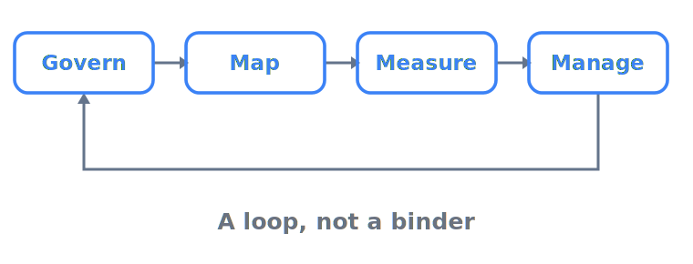

# Compliance & governance — proving you were in control

> **In one sentence:** Governance is the infrastructure that lets you answer the one question that ends
> the meeting after an agent misbehaves — *"prove you were in control"* — which is why a gap here is an
> attributable infrastructure failure, not a model-quality one.

Of the seven pillars, this is the one a regulator, an auditor, or a court actually tests. The others —
limits, guardrails, observability, identity, rollback — are the *controls*; governance is the **evidence
that those controls existed, were chosen on purpose, and were working** when it mattered. It is written
for the person who signs the go-live and owns the fallout: they can already build the agent; the gap is
defending it the morning after. The [deep-dives](#going-deeper) walk the hardest parts in detail.

---

## Where this breaks in production

Compliance for agents is not about intentions; it is about **artifacts**. No auditor accepts "we have
guardrails" — they accept the prompt-injection test report, the model-inventory entry, six months of
retained logs, the dated and signed impact assessment. The recurring trap: the system works in
production, the controls were never built as *evidence*, and the proof that would have passed an audit
was never produced.

Several of the failures documented in this repository are governance failures, not model failures. Air
Canada's support bot invented a refund policy; a tribunal held that **the operator owns the output** and
rejected "the chatbot is a separate legal entity" as a defence — the airline paid
([*Moffatt v. Air Canada*](../case-studies/air-canada-chatbot.md)). New York City's official MyCity bot
told business owners to break the law and was **left online** afterward, because no review gate or
accountable owner was positioned to pull it ([NYC MyCity](../case-studies/nyc-mycity-chatbot.md)). When
an agent [deleted a production database at Replit](../case-studies/replit-database-deletion.md), the
absence of a trustworthy trace and rollback path turned a mistake into a crisis. In each, what was
missing was the scaffolding — grounding, a review gate, a named owner, a record.

The regulatory direction runs one way: toward *you must be able to demonstrate control*. The EU AI Act
turns that into binding law backed by fines up to **€35 million or 7% of global annual turnover**
([Regulation (EU) 2024/1689](https://eur-lex.europa.eu/eli/reg/2024/1689/oj/eng), Art. 99), and reported
AI incidents are climbing fast — a ballpark **233 in 2024, up ~56% year-on-year**
([Stanford HAI AI Index 2025](https://hai.stanford.edu/ai-index/2025-ai-index-report/responsible-ai)).
"We couldn't reconstruct what happened" stops being an awkward admission and becomes a liability.

## Governance is a loop, not a binder

The most common mistake is to treat governance as a document — a policy PDF written once, signed, and
filed. Every framework worth using describes the same *continuous loop* instead: **set the policy →
assess the risk → operate with controls → keep the evidence → review and improve**, then round again. The
names differ; the loop does not.

That loop is why governance is *infrastructure* and not paperwork: like observability or rollback, it has
to run while the agent runs. An agent's risk surface moves — a new tool, a changed prompt, a model upgrade
each shift what it can do — so a one-time assessment is stale the first time the system changes.
**Governance that does not re-enter the loop on change is governance in name only.**

  

## Classify first — your risk tier sets the bill

Before any control, one classification decides almost everything: **which risk tier your system falls
into.** The EU AI Act sorts AI by potential to harm, and obligations scale steeply with the tier
([Regulation (EU) 2024/1689](https://eur-lex.europa.eu/eli/reg/2024/1689/oj/eng)):

- **Unacceptable** — banned practices (e.g. social scoring, most real-time biometric identification); do
  not deploy these at all (Art. 5).
- **High-risk** — systems in regulated products or the Annex III areas (hiring, credit, biometrics,
  essential services, education, justice); the full load — risk management, data governance, technical
  documentation, logging by design, human oversight, accuracy/robustness (Arts. 9–17).
- **Limited** — systems that interact with people or generate content; owe **transparency**: tell users
  they're dealing with AI, label AI-generated content (Art. 50).
- **Minimal** — everything else; no specific obligations.

**Classifying honestly is the first governance act.** The same model carries wildly different legal weight
depending on where you wire it: an agent that screens job applicants is high-risk; one that drafts your
own meeting notes is minimal. Most agents land in *limited* or *minimal*, but the few that touch an Annex
III area inherit a heavy, slow-to-retrofit obligation set, and guessing the tier is not a defence. A
separate track governs **general-purpose AI models** themselves (Art. 53: technical documentation,
copyright policy, training-data summary), with the official
**[GPAI Code of Practice](https://digital-strategy.ec.europa.eu/en/policies/contents-code-gpai)** as the
voluntary route to showing compliance — relevant if you *provide* a model, not only if you deploy one.

## The framework stack — three jobs, not three choices

You do not pick between the major frameworks; they **stack**, each doing a different job:

| Framework | What it is | Binding? | Its job in your stack |
|-----------|------------|----------|-----------------------|
| **EU AI Act** ([2024/1689](https://eur-lex.europa.eu/eli/reg/2024/1689/oj/eng)) | Risk-tiered AI *law* in the EU | **Yes** — fines to €35M / 7% turnover | Sets the legal floor and the evidence you must be able to produce. |
| **NIST AI RMF** ([AI 100-1](https://www.nist.gov/itl/ai-risk-management-framework)) | Voluntary US framework — Govern / Map / Measure / Manage | No (de-facto common language) | The operating model for *how* you actually run the risk loop. |
| **ISO/IEC 42001** ([:2023](https://www.iso.org/standard/81230.html)) | First certifiable AI management system (AIMS) standard | No, but certifiable | The auditable shell that proves, on paper, that the loop runs. |

They interlock: NIST gives you the verbs (auditors increasingly ask "*which* AI RMF function does this
control satisfy?"), ISO 42001 gives you the certifiable management system and its **Statement of
Applicability** — justifying which controls you implemented and which you excluded — and the EU AI Act
makes a subset legally mandatory. Implement one well and you have most of the next.

Sitting across all three is a security risk taxonomy. OWASP ranks **excessive agency** and **unbounded
consumption** among the top LLM risks ([OWASP Top 10 for LLM Applications](https://genai.owasp.org/llm-top-10/)),
and now publishes a dedicated **[Top 10 for Agentic Applications](https://genai.owasp.org/resource/owasp-top-10-for-agentic-applications-for-2026/)**
for agent-specific threats (goal hijacking, tool misuse, identity and privilege abuse, rogue agents) —
the threat lists customers expect you to have tested against, and the test reports are governance
evidence.

One caution on timelines: **the EU AI Act's own dates are in motion.** The headline schedule runs entry
into force (1 Aug 2024) through prohibited practices (Feb 2025), GPAI obligations (Aug 2025), and
high-risk obligations (2 Aug 2026). But a 2026 "Digital Omnibus" simplification package — provisional
political agreement on **7 May 2026** — would defer the stand-alone high-risk (Annex III) obligations to
**2 December 2027**
([Council of the EU](https://www.consilium.europa.eu/en/press/press-releases/2026/05/07/artificial-intelligence-council-and-parliament-agree-to-simplify-and-streamline-rules/)).
That agreement is **not yet in the Official Journal**, so treat all of these as ballpark and confirm
against the current consolidated text.

## Agents raise the bar over chatbots

A tool-using, multi-step agent **acts in the world** — it books, refunds, deletes, and delegates — so
governance has to bound *what it may do*, not only *what it may say*. That is why "excessive agency" is
the agent-defining risk, and why the concrete artifact behind it is a **tool-permission matrix**: each
tool, scoped to which credential, behind which approval gate, with logs proving the boundary held. The
agentic threat surface adds memory poisoning, agent-to-agent trust abuse, and goal hijack on top of the
familiar prompt-injection problem; red-team findings are best tagged to a shared taxonomy like
**[MITRE ATLAS](https://atlas.mitre.org/)** so coverage is legible to auditors.

Agents also do not escape the regimes that already governed the process they automate. When an agent
touches personal data, money, health records, or cardholder data, it becomes just another in-scope system
under **GDPR** (data-subject rights, automated-decision limits, a 72-hour breach clock, fines to €20M / 4%
— [Regulation (EU) 2016/679](https://eur-lex.europa.eu/eli/reg/2016/679/oj/eng), Arts. 33 & 83), SOC 2,
HIPAA, PCI DSS, or banking model-risk guidance. The agent inherits the obligations of the job it was
given.

## "In control" is a set of artifacts you can produce

"We were in control" is worth only what you can show. In an audit the asymmetry is unforgiving: **a
control you cannot evidence did not, for the record, exist.** Being in control means being able to
produce, on demand: the system's technical documentation; automatic run logs (the EU AI Act requires
retention for a period appropriate to use and **at least six months**); the dated risk assessment and its
sign-off; evaluation and red-team results; and a version history pinning each production decision to a
reproducible model-and-prompt config
([Regulation (EU) 2024/1689](https://eur-lex.europa.eu/eli/reg/2024/1689/oj/eng), Arts. 11–12). Simple to
state, hard to retrofit: **generate the evidence as a by-product of running the agent, not as a project
after it fails.**

## Going deeper

This page is the landscape; three deep-dives walk the hardest ground:

- **[The EU AI Act for agentic systems](eu-ai-act.md)** tier by tier through the law — the high-risk
  obligation set, the phased timeline, penalties, and what an operator must actually produce.
- **[NIST AI RMF as an operating model](nist-ai-rmf.md)** governance as a running loop — Govern, Map,
  Measure, Manage — with the Generative AI Profile for LLM and agent specifics.
- **[Audit evidence — proving you were in control](audit-evidence.md)** the artifact-by-artifact kit —
  what to keep, anchored to which obligation, and for how long.

When you reach sign-off, the [go-live checklist](../../checklists/compliance-and-governance.md) makes each
control checkable, and the [risk register](../../risk-register/compliance-and-governance.md) scores the
governance risks so you fix the worst first.

---

## Sources

- **[Regulation (EU) 2024/1689 (EU AI Act)](https://eur-lex.europa.eu/eli/reg/2024/1689/oj/eng)** (EUR-Lex / Official Journal) — primary legal text: risk tiers (Art. 5 / Annex III), transparency (Art. 50), high-risk obligations and documentation/logging (Arts. 9–17, esp. 11–12, ≥6-month retention), GPAI duties (Art. 53), and the penalty ceilings (Art. 99, €35M / 7%).
- **[Digital Omnibus on AI — Council/Parliament agreement](https://www.consilium.europa.eu/en/press/press-releases/2026/05/07/artificial-intelligence-council-and-parliament-agree-to-simplify-and-streamline-rules/)** (Council of the EU) — official record of the 7 May 2026 provisional political agreement to defer stand-alone high-risk (Annex III) obligations to 2 Dec 2027; provisional, not yet in the Official Journal.
- **[GPAI Code of Practice](https://digital-strategy.ec.europa.eu/en/policies/contents-code-gpai)** (European Commission) — the official voluntary route to demonstrating Art. 53 GPAI-model compliance.
- **[AI Risk Management Framework (AI RMF 1.0)](https://www.nist.gov/itl/ai-risk-management-framework)** (NIST) — the Govern / Map / Measure / Manage loop and the common audit vocabulary.
- **[ISO/IEC 42001:2023](https://www.iso.org/standard/81230.html)** (ISO) — the first certifiable AI management system standard; backs the AIMS / Statement-of-Applicability framing.
- **[ISO/IEC 42001 explained — what it is](https://www.iso.org/home/insights-news/resources/iso-42001-explained-what-it-is.html)** (ISO) — the official, non-paywalled overview confirming 42001 as the world's first AI management system standard, for readers without access to the priced standard text.
- **[OWASP Top 10 for LLM Applications (2025)](https://genai.owasp.org/llm-top-10/)** (OWASP) — backs *excessive agency* and *unbounded consumption* as top agent risks.
- **[OWASP Top 10 for Agentic Applications (2026)](https://genai.owasp.org/resource/owasp-top-10-for-agentic-applications-for-2026/)** (OWASP) — the agent-specific threat list (goal hijack, tool misuse, identity/privilege abuse, rogue agents).
- **[MITRE ATLAS](https://atlas.mitre.org/)** (MITRE) — the adversarial-ML taxonomy used to tag agent red-team findings.
- **[General Data Protection Regulation (EU) 2016/679](https://eur-lex.europa.eu/eli/reg/2016/679/oj/eng)** (EUR-Lex / Official Journal) — the sector-overlay example: data-subject rights, automated-decision limits, the 72-hour breach clock (Art. 33), and the €20M / 4% fine ceiling (Art. 83) that bind agents touching personal data.
- **[2025 AI Index — Responsible AI](https://hai.stanford.edu/ai-index/2025-ai-index-report/responsible-ai)** (Stanford HAI) — the incident-trend figure (233 reported incidents in 2024, +56.4% YoY), which the report draws from the AI Incidents Database.

<!-- page-type: overview -->
