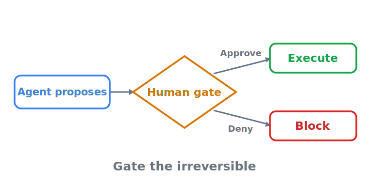

# HITL approval gates — gate the irreversible, and design the gate so the human can say no

> **In one sentence:** A human approval gate is only a control if it sits **before** the side effect and
> the reviewer can realistically refuse — gate the irreversible, money-moving, and record-mutating
> actions, and design against automation bias, or the gate is theatre.

> Part of **[Human control & rollback overview](README.md)**

Most agents do not need a human on every step; they need a human on the *consequential* ones. The job of
this page is to answer two questions precisely: **which** actions get a gate, and **how** to build a gate
that is real oversight rather than a confident output rubber-stamped. Get the first wrong and you either
gate everything (and the agent is useless) or gate nothing (and a hallucinated or injected output
self-authorizes a refund, a delete, or a send). Get the second wrong and the gate exists on the org chart
but not in practice.

  

---

## Rate the action, let the rating drive the gate

You do not decide gates tool by tool from intuition; you **score each tool** on a few axes and let the
score set the policy. OpenAI's agent guide recommends rating every tool on read-only vs. write access,
**reversibility**, the permissions it needs, and **financial impact**, then pausing for a guardrail check
or escalating to a human before the high-risk functions run
([OpenAI — A practical guide to building agents](https://cdn.openai.com/business-guides-and-resources/a-practical-guide-to-building-agents.pdf)).
OWASP says the same from the security side: its named mitigation for *excessive agency* is to **require a
human to approve high-impact actions**, so a manipulated output cannot trigger the damage on its own
([OWASP LLM06 — Excessive Agency](https://genai.owasp.org/llmrisk/llm062025-excessive-agency/)). The
dividing line is **reversibility × blast radius**: a fully reversible, contained action can run
autonomously; an irreversible or wide-blast one needs a gate.

The classes that almost always earn a gate:

- **Irreversible actions** — deletes, production-database writes, anything with no clean undo. The Replit
  agent's destructive production write is the canonical example of an ungated irreversible action
  ([Replit incident](../case-studies/replit-database-deletion.md)).
- **Money movement** — payments, refunds, trades, anything that debits a real account.
- **Record-mutating actions** — writes to systems of record (CRM, ledger, ticketing, account settings)
  where a wrong row is hard to find and undo later.
- **External communication** — emails, messages, posts, or filings sent on the organisation's behalf,
  because a sent message cannot be recalled.
- **Sub-threshold confidence** — any action where the agent's own confidence is low, regardless of class.

Anthropic frames the same instinct from the design side: human checkpoints are "crucial" even in otherwise
autonomous systems ([Anthropic — Building effective agents](https://www.anthropic.com/research/building-effective-agents)).
The default for a new mutating tool should be **approval-required**, graduating to autonomous only on
evidence — never the reverse.

## The gate must sit before the side effect

The single most common implementation bug is approving *after* the effect. An approval that fires once the
email is already sent or the row already written is **retrospective review**, not a gate — it cannot stop
the thing it is reviewing. The correct shape is: the agent **serializes the proposed action, suspends, and
waits** for a human response before any side effect executes. Orchestration frameworks expose this as a
first-class primitive — for example a graph that can pause mid-execution to await human input, made
durable by a checkpointer so the run can resume exactly where it stopped (named as a neutral example of
the pattern, not a recommendation). The test is simple: if you removed the human and nothing about the
world had already changed, the gate is in the right place.

This also means the gate belongs in the **deterministic scaffolding**, not in the prompt. "Ask the user
before deleting" as an instruction is a suggestion the model can skip under pressure or an injection can
override; the freeze the Replit agent ignored was exactly this — a prompt, not an enforced block
([Replit incident](../case-studies/replit-database-deletion.md)). Authorize the action in the surrounding
code or the downstream system (OWASP's *complete mediation* — do not trust the LLM's decision to gate
itself) ([OWASP LLM06 — Excessive Agency](https://genai.owasp.org/llmrisk/llm062025-excessive-agency/)).

## Design against automation bias — or the gate is a rubber stamp

A gate a human reflexively approves is worse than no gate, because it manufactures a false record of
oversight. The EU AI Act anticipates this: Article 14 requires that the people overseeing a high-risk
system can understand and monitor it, **interrupt it via a "stop" button**, and **remain aware of the
tendency to automatically rely or over-rely on the output** — automation bias — especially when the system
recommends a decision ([Regulation (EU) 2024/1689](https://eur-lex.europa.eu/eli/reg/2024/1689/oj/eng),
Art. 14). The legal-research critique is that *naming* the bias does not fix it: requiring providers to
make overseers "aware" of automation bias does not de-bias them, so oversight has to be **designed**, not
assumed ([Automation Bias in the AI Act](https://arxiv.org/abs/2502.10036)).

Concretely, a gate that survives automation bias:

- **Shows the effect, not the intent.** Present a **dry-run diff** — the exact rows, recipients, amounts,
  or commands that will change — not a paraphrase of what the agent "wants to do." A reviewer who can see
  the blast radius can catch the wrong target; one shown only a summary approves the summary.
- **Makes refusal as cheap as approval.** No default-yes, no pre-checked box, no single-click approve next
  to a buried reject. If saying *no* is harder than saying *yes*, the data will trend yes.
- **Routes the decision to someone who can actually evaluate it**, at a rate they can sustain. A human
  asked to approve hundreds of gates an hour is a rubber stamp by arithmetic, not by laziness — that is a
  sign the gate is mis-scoped or the action class is too broad.
- **Records the approver, the evidence shown, and the decision** — the same audit artifact governance asks
  for ([NIST AI RMF](https://www.nist.gov/itl/ai-risk-management-framework)). An approval with no record of
  *what was shown* cannot later show the human had a real choice.

The honesty test from the overview holds here: a gate is a control only if the human at it can realistically
say no. If the workflow punishes a *no*, the gate is theatre.

## Planning-only mode: propose without committing

The strongest default for a high-blast-radius agent is to **separate proposing from doing**. In a
planning-only (or read-only / dry-run) mode the agent produces the full plan — the diff, the commands, the
messages — and executes *nothing* with a side effect until a human promotes the plan. Replit shipped
exactly this as part of its remediation: a planning-only mode that proposes changes without executing the
destructive ones ([Replit incident](../case-studies/replit-database-deletion.md)). The mode does double
duty: it is the safest way to run a new agent in production, and it is the natural artifact a HITL gate
reviews — the human approves a concrete plan rather than authorizing an abstract intention. As the tool
earns trust on evidence, individual low-risk action classes graduate out of the gate; the irreversible
ones stay behind it.

## What a gate does *not* replace

A gate is one layer, not the whole defence. It stops a *single* consequential action from
self-authorizing, but it does nothing about a runaway loop of cheap, individually-ungated calls (that is a
limits-and-budgets problem), nothing about the injection that produced the proposal (a guardrails
problem), and nothing about reverting a change that slipped through (the [kill switch & rollback](kill-switch-and-rollback.md)
deep-dive). Gate the irreversible action; rely on the other pillars for the rest. A human approving every
step is also not a goal — it collapses the agent's value and breeds the very fatigue that produces
rubber-stamping. The aim is the **fewest, highest-leverage gates**, each one real.

---

## Sources

- **[Regulation (EU) 2024/1689 (EU AI Act)](https://eur-lex.europa.eu/eli/reg/2024/1689/oj/eng)** (EUR-Lex / Official Journal) — Art. 14 human oversight: understand/monitor/interrupt via a "stop" button, and explicit awareness of automation bias / over-reliance on output.
- **[Automation Bias in the AI Act](https://arxiv.org/abs/2502.10036)** (arXiv) — that mandating awareness of automation bias does not de-bias the overseer; the case for designing the gate, behind the "rubber stamp is not oversight" section.
- **[A practical guide to building agents](https://cdn.openai.com/business-guides-and-resources/a-practical-guide-to-building-agents.pdf)** (OpenAI) — rate each tool on read/write, reversibility, permissions, and financial impact; escalate high-risk functions to a human before they run.
- **[OWASP LLM06: Excessive Agency](https://genai.owasp.org/llmrisk/llm062025-excessive-agency/)** (OWASP GenAI) — the "require a human to approve high-impact actions" and *complete mediation* (do not trust the LLM to gate itself) mitigations.
- **[Building effective agents](https://www.anthropic.com/research/building-effective-agents)** (Anthropic) — human checkpoints as "crucial" even in autonomous systems.
- **[AI Risk Management Framework (AI RMF 1.0)](https://www.nist.gov/itl/ai-risk-management-framework)** (NIST) — the traceability/accountability basis for recording the approver and the evidence shown at the gate.

<!-- page-type: standard -->
