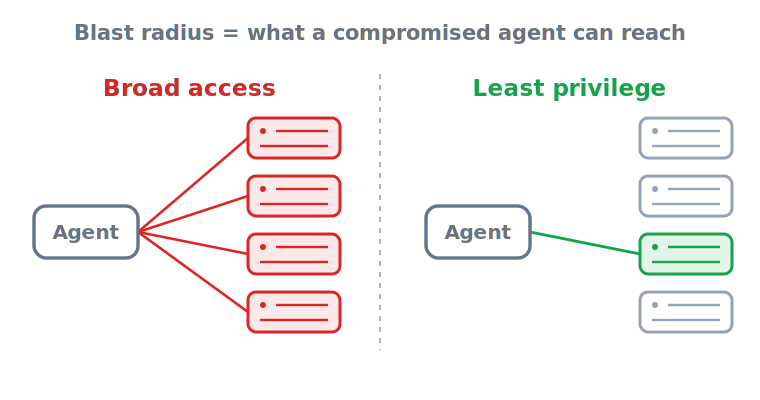

# Least-privilege tools — the permission matrix

> **In one sentence:** Excessive agency — too much permission, functionality, or autonomy — is OWASP's
> top-ranked agent risk, and the concrete control that bounds it is a tool-permission matrix where each tool
> is scoped to one credential, behind an approval gate sized to its blast radius, with a log that proves the
> boundary held.

> Part of **[Identity & access overview](README.md)**

Tools are where the agent touches the real world, which makes the tool layer the highest-blast-radius
surface in the system. This page builds the **tool-permission matrix** — the artifact this pillar exists to
produce — tool by tool: how to scope each to least capability, how to ladder from read-only to gated
mutation, where approval gates go, and why "complete mediation" means the boundary is enforced downstream,
not by trusting the model.

  

---

## Excessive agency is the risk this matrix bounds

OWASP ranks **excessive agency** among the top LLM risks, defining it as the damage that becomes possible
"whenever an LLM-based system is granted a degree of agency" beyond what its task needs. Its three named
root causes are **excessive functionality** (tools the agent didn't need), **excessive permissions** (more
downstream access than the task requires), and **excessive autonomy** (acting on high-impact operations
without human verification) ([OWASP LLM06](https://genai.owasp.org/llmrisk/llm062025-excessive-agency/)). The
key insight is that the trigger doesn't matter: a hallucination, an indirect prompt injection, or a simple
logic error all become *real damage* through the same channel — the permissions the tool carries. That is
why excessive agency is "the vulnerability that enables damaging actions … regardless of what is causing the
LLM to malfunction." The matrix is the control that makes the channel narrow.

The 2026 agentic framing adds a useful reframe: **least agency**. Beyond *least privilege* (what an agent
can access), autonomy itself is a privilege to be earned per tool, not granted by default — *how much
freedom* an agent has to act without checking back is a control surface of its own
([OWASP Top 10 for Agentic Applications 2026](https://genai.owasp.org/resource/owasp-top-10-for-agentic-applications-for-2026/)).

## The tool-permission matrix

The artifact is a table. For every tool the agent can call, you record the credential it runs under, the
scope that credential carries, the risk tier, the gate in front of it, and where the action is logged. Built
honestly, it answers the audit question outright: *prove the agent could only do what it was allowed to do.*

| Tool | Runs as (credential) | Scope (least capability) | Risk tier | Gate | Logged where |
|------|----------------------|--------------------------|-----------|------|--------------|
| `search_kb` | read-only KB token | one index, read | low | none (autonomous) | tool-call trace |
| `read_invoice` | billing API token | read, single invoice in user context | low | none | tool-call trace |
| `send_email` | mail relay, allow-listed senders | send, no attachments | medium | rate-limit + content check | audit log |
| `issue_refund` | payments token | refund ≤ \$N, one order | high | human approval | audit log + ticket |
| `run_sql` | DB role, **read replica only** | SELECT on N tables | high (write = blocked) | writes require approval | audit log |

The columns are not decoration — each maps to an OWASP mitigation. *Runs as* and *Scope* implement
**minimize permissions**; the table itself implements **minimize extensions** and **minimize extension
functionality** (if a tool isn't on the matrix, the agent can't call it); *Gate* implements **require human
approval of high-impact actions**; *Logged where* is the evidence that the boundary held
([OWASP LLM06](https://genai.owasp.org/llmrisk/llm062025-excessive-agency/)).

## Scope each tool to least capability

Least privilege at the tool boundary means the credential a tool runs under opens the *smallest* thing that
still does the job. Concretely:

- **Read-only by default.** Most agent value is retrieval and analysis, which never needs write access. Give
  read tools read-only credentials so a misfire can't mutate anything.
- **Narrow the resource, not just the verb.** "Read the database" is too broad; "SELECT on these three
  tables via a read replica" is least-capability. The `run_sql` row above blocks writes at the *database
  role*, so even a perfectly-formed destructive query has nothing to act on.
- **Bound the parameters.** A refund tool scoped to "≤ \$N, one order" caps the damage of a wrong call
  regardless of what the model intended.
- **Avoid open-ended tools.** A generic "make an HTTP request" or "run any shell command" tool is excessive
  functionality by construction — it grants the agent capabilities far beyond the task. OWASP's mitigation
  is explicit: *avoid open-ended extensions* and prefer granular, specific tools
  ([OWASP LLM06](https://genai.owasp.org/llmrisk/llm062025-excessive-agency/)).

The **[Replit database deletion](../case-studies/replit-database-deletion.md)** is the cautionary tale for
this column: an agent with direct write access to a production database is one bad call away from
destruction, and the cheapest control that would have prevented it — keeping the agent off production data
by default, the read-replica row above — is a scoping decision, not a smarter model.

## The autonomy ladder: read-only → gated mutation → earned autonomy

Not every tool deserves a gate, and gating everything trains reviewers to rubber-stamp. Rate each tool and
let the rating drive the gate. A practical scoring axis: read-only vs. write access, reversibility, the
permissions required, and the financial or data impact — score each tool low/medium/high and pause for a
guardrail check or a human before high-risk functions execute. OpenAI's *A practical guide to building agents*
recommends exactly this risk-rating axis: assign low/medium/high ratings to actions by read-only vs. write
access, reversibility, required permissions, and financial impact, and use the rating to trigger a guardrail
check or human escalation before a high-risk function runs
([OpenAI — A practical guide to building agents](https://cdn.openai.com/business-guides-and-resources/a-practical-guide-to-building-agents.pdf)).
OWASP's mitigation is the floor: *require a human to approve high-impact actions* so an injected
or hallucinated output can't self-authorize ([OWASP LLM06](https://genai.owasp.org/llmrisk/llm062025-excessive-agency/)).

The ladder, from least to most autonomy:

1. **Autonomous** — low-risk, reversible, read-only tools (search, read, summarize). No gate.
2. **Gated mutation** — anything that writes, sends, deletes, moves money, or touches another system. Pause
   before the side effect, present a dry-run diff, require approval. **The approval must happen *before* the
   side effect** — a review after the fact is just retrospective logging, not a gate.
3. **Earned autonomy** — a previously-gated tool may graduate to autonomous *only* on evidence (clean
   approval history, tight scope, low impact), per the least-agency principle that autonomy is earned, not
   default ([OWASP Top 10 for Agentic Applications 2026](https://genai.owasp.org/resource/owasp-top-10-for-agentic-applications-for-2026/)).

This pillar owns *which credential and which gate*; the mechanics of the human checkpoint itself — how the
reviewer is presented the action and how the agent suspends until they respond — belong to the human-control
& rollback pillar.

## Complete mediation: enforce the boundary downstream, not in the prompt

The single most important rule, and the one teams get wrong most often: **do not let the LLM be the thing
that decides whether an action is allowed.** A system prompt that says "only refund orders under \$50" is a
suggestion an injection can override; the boundary has to be enforced where the action actually happens.
OWASP calls this **complete mediation**: *"implement authorization in downstream systems rather than relying
on an LLM to decide if an action is allowed"*
([OWASP LLM06](https://genai.owasp.org/llmrisk/llm062025-excessive-agency/)). In the matrix above, the
`issue_refund` cap and the `run_sql` write-block are enforced by the *credential and the downstream service*,
not by the model's good behavior — so even a fully-hijacked agent is still bounded by what its keys open. The
**[EchoLeak](../case-studies/echoleak-m365-copilot.md)** incident is the same lesson from the data side: the
blast radius of a successful injection was set by what the assistant's identity could reach and send, not by
the wording of any prompt-level instruction.

## Sources

- **[LLM06:2025 Excessive Agency](https://genai.owasp.org/llmrisk/llm062025-excessive-agency/)** (OWASP GenAI Security Project) — the top-ranked risk, its three root causes, and the mitigation set the matrix implements: minimize extensions/functionality/permissions, avoid open-ended extensions, require human approval of high-impact actions, and **complete mediation** (authorize downstream, not in the LLM).
- **[OWASP Top 10 for Agentic Applications 2026](https://genai.owasp.org/resource/owasp-top-10-for-agentic-applications-for-2026/)** (OWASP GenAI Security Project) — the *least agency* reframing: autonomy as a per-tool privilege earned on evidence, not granted by default.
- **[A practical guide to building agents](https://cdn.openai.com/business-guides-and-resources/a-practical-guide-to-building-agents.pdf)** (OpenAI) — the risk-rating axis behind the autonomy ladder: rate actions low/medium/high on read/write access, reversibility, permissions, and financial impact, and gate or escalate high-risk functions to a human; named as a neutral example.
- **[Replit AI Agent Deletes a Production Database](../case-studies/replit-database-deletion.md)** (this repository) — the case for read-only-by-default and keeping agents off production data: unscoped write access wiped a live database.
- **[EchoLeak — zero-click exfiltration in M365 Copilot](../case-studies/echoleak-m365-copilot.md)** (this repository) — the blast radius of a successful injection is set by what the agent's identity can reach and send.

<!-- page-type: standard -->
