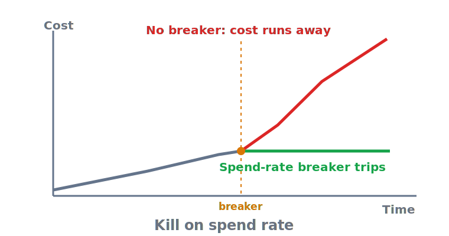

# Denial of wallet — the attack that bills you instead of breaking you

> **In one sentence:** Denial of wallet escalates your cost without degrading your service, so it slips past
> the availability alarms built for denial of service — and the control that contains it is a spend-rate
> circuit breaker that kills the agent on a threshold breach, not a per-run cap that lets the spike finish.

> Part of **[Limits & budgets overview](README.md)**

Most outage tooling watches for things going *down* — latency climbing, error rates spiking, a service
falling over. Denial of wallet is engineered to do none of that. The application keeps responding normally
while an attacker, or a stuck loop, drives the meter; the first signal is the invoice. This page defines the
failure class, explains why the monitoring you already have is blind to it, and works the one control that
catches the *fast* runaway the slower caps in this pillar would let burn: a circuit breaker keyed to
spend rate.

  

---

## What denial of wallet is, and why it evades your alarms

OWASP's Unbounded Consumption category names it directly: in a **denial-of-wallet** attack, an adversary
exploits the **cost-per-use** model of an LLM service to drive economic loss
([OWASP LLM10](https://genai.owasp.org/llmrisk/llm102025-unbounded-consumption/)). The defining property —
and the reason it is dangerous — is that it targets the bill, not the service. As the survey literature puts
it, such attacks "focus on escalating costs without impacting service operation," so they do not degrade
performance or availability and therefore **do not trip the alarms designed to detect outages**; the
application keeps functioning normally while costs accumulate undetected
([arXiv 2508.19284 — Denial of Wallet Attacks](https://arxiv.org/abs/2508.19284)). A monitoring stack tuned
to latency, error rate, and uptime is structurally blind to this: every one of those signals stays green
while the spend graph climbs.

It does not require an adversary. The same end state — cost escalating while the system looks healthy —
arrives from an internal bug: a loop with no iteration ceiling, a retry storm against an empty result, a
prompt change that quietly doubled token use. The threat model and the failure model converge on the same
control.

## Why a per-run budget alone is not enough

The [cost & token budget](cost-and-token-budgets.md) caps bound a single run and a daily total, and they are
necessary — but they have a gap a circuit breaker fills. A per-run ceiling lets one run spend right up to
its limit before stopping; if that limit is sized for a legitimate heavy task, a *single* abusive or
buggy run can burn the whole allowance before the cap fires. A daily quota is coarser still — it stops new
work only after the day's budget is already gone. Neither watches the **rate** of spend. The runaway that
matters most is the fast one: spend per minute spiking far above baseline. That is what a circuit breaker is
for.

## The spend-rate circuit breaker

A circuit breaker is a control that **trips to an open (stopped) state when a monitored signal crosses a
threshold**, cutting off the operation rather than letting it continue — the established resilience pattern
popularised by Michael Nygard's *Release It!* and described by Martin Fowler, where a wrapper monitors a
protected call for failures and, once they cross a threshold, trips so that further calls fail fast instead
of being made ([Martin Fowler — Circuit Breaker](https://martinfowler.com/bliki/CircuitBreaker.html)).
Applied here, the monitored signal
is the *rate* of consumption — tokens or dollars per unit time, per agent, per tenant — and tripping means
halting the agent and routing to a safe fallback. The design has three parts:

- **Trip conditions keyed to spend rate, not just latency or quality.** Trip when spend-per-minute exceeds a
  multiple of baseline, or on cheaper proxies that correlate with a runaway — **repeated identical tool
  calls**, a burst of **consecutive rate-limit (429) responses**, or consumption diverging sharply from the
  normal pattern (anomaly detection) ([OWASP LLM10](https://genai.owasp.org/llmrisk/llm102025-unbounded-consumption/)).
- **A hard stop, enforced in code.** When tripped, the breaker terminates the agent at the orchestration
  layer before the next metered call — the same "enforce outside the model" rule as every cap in this
  pillar. A breaker the model can talk past is not a breaker.
- **A safe open state and a controlled reset.** Open should degrade gracefully — a clear refusal, a queued
  response, escalation to a human — not a crash; and the breaker should reset deliberately (on a human ack
  or after a cool-down with the cause addressed), not flap back on into the same runaway
  ([OWASP LLM10](https://genai.owasp.org/llmrisk/llm102025-unbounded-consumption/)).

The breaker is the fast layer on top of the slow caps: budgets and quotas bound the *total*, the breaker
bounds the *rate*, and together they leave a runaway nowhere to hide between "one expensive run" and "a
thousand cheap ones."

## Per-entity quotas contain the abuse

Denial of wallet is often driven by one source — an abusive tenant, a leaked key, a single hostile user — so
**per-entity quotas** are the containment layer that stops one identity from consuming the whole budget.
OWASP's mitigation is to "apply rate limiting and user quotas to restrict the number of requests a single
source entity can make in a given time period," combined with access controls and least privilege so a
compromised credential has a bounded blast radius
([OWASP LLM10](https://genai.owasp.org/llmrisk/llm102025-unbounded-consumption/)). This is where the
[per-tenant attribution](cost-and-token-budgets.md) tagging pays off operationally: you can only quota and
breaker *per entity* if every call is tagged with the entity that made it.

## The side-effect dimension: the bill is the cheap part

Cost exhaustion frames the risk in dollars, but a runaway loop that touches side-effecting tools is doing
worse than spending money. Each extra iteration may send an email, write a row, or process a charge —
effects that do not roll back the way compute sometimes does. Replit's agent is the worked example: the
damage that mattered was a wiped production database, not the inference cost, and the missing control was an
enforced action limit, not a bigger budget alert
([Replit database deletion](../case-studies/replit-database-deletion.md)). So a circuit breaker on a
side-effecting agent should trip on **mutating-action rate** as well as spend rate — the number of
irreversible operations per minute is the signal that bounds the harm the bill alone would understate. The
Chevrolet bot shows the cost-and-reputation face of the same gap: an unscoped agent manipulated into absurd
commitments because nothing bounded what adversarial input could make it do
([Chevrolet dealership chatbot](../case-studies/chevrolet-dealership-chatbot.md)).

---

## Sources

- **[OWASP LLM10:2025 Unbounded Consumption](https://genai.owasp.org/llmrisk/llm102025-unbounded-consumption/)** (OWASP GenAI Security Project) — names denial of wallet as exploitation of the cost-per-use model and supplies the containment controls: rate limiting, per-entity quotas, anomaly detection, access controls/least privilege, and graceful degradation.
- **[A Comprehensive Review of Denial of Wallet Attacks in Serverless Architectures](https://arxiv.org/abs/2508.19284)** (arXiv) — the definition this page turns on: DoW "escalates costs without impacting service operation," so it evades the availability/DoS alarms tuned for outages, and detection needs anomaly-based monitoring of consumption.
- **[Circuit Breaker](https://martinfowler.com/bliki/CircuitBreaker.html)** (Martin Fowler) — the canonical description of the resilience pattern (trip on threshold, fail fast, controlled reset), from Michael Nygard's *Release It!*, that the spend-rate breaker adapts.

<!-- page-type: standard -->
