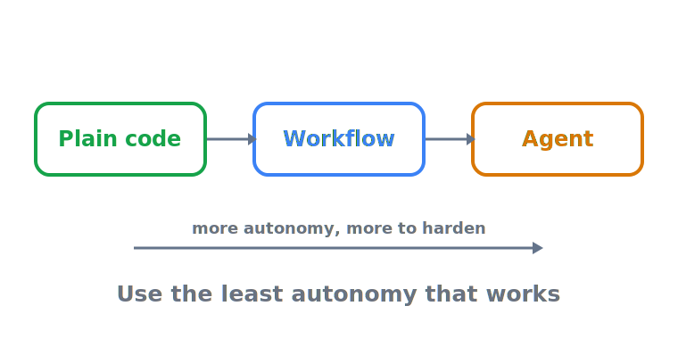

# Workflow vs. agent — drawing the line on purpose

> **In one sentence:** A workflow runs your code paths with an LLM in some of the steps; an agent lets the
> LLM run its own — and because the agent rung is where the infrastructure bill starts, the line between
> them should be drawn deliberately, not by default.

> Part of **[When to use agents overview](README.md)**

The word "agent" is used for everything from a single prompt with one tool to a swarm of coordinating
LLMs, which makes "should we use an agent?" almost unanswerable as asked. The three major engineering
guides — Anthropic, OpenAI, AWS — converge on a sharper question: *how much autonomy does this task force
on us, and have we earned the next rung?* This page sets the definitions, the signals that genuinely earn
an agent, and the spectrum that connects them, so a feature lands on the lowest rung that does the job.

  

---

## The definition that does the work

Anthropic draws the line the rest of this pillar rests on
([Anthropic — Building effective agents](https://www.anthropic.com/research/building-effective-agents)):

- **Workflows** are "systems where LLMs and tools are orchestrated through *predefined code paths*." The
  control flow is yours; the LLM fills in steps you laid out.
- **Agents** are "systems where LLMs *dynamically direct their own processes and tool usage*, maintaining
  control over how they accomplish tasks." The control flow is the model's; you set the goal and the
  guardrails.

That single distinction reorganises the cost picture. In a workflow, predictability lives in code you can
read and test; the failure modes are the LLM-step failures you can eval node by node. In an agent, the
model decides what to do next, so you inherit a new class of failures — runaway loops, tool misuse,
compounding errors — and the controls that bound them. Anthropic's governing rule is therefore to "find the
simplest solution possible, and only increase complexity when needed," adding agentic loops "only when
simpler solutions fall short," because agents "trade latency and cost for better task performance"
([Anthropic — Building effective agents](https://www.anthropic.com/research/building-effective-agents)).
The autonomous loop itself is the foundational ReAct (reason + act) pattern: the model reasons, acts via a
tool, observes the result, and repeats until a stop reason ([Yao et al., ICLR 2023](https://arxiv.org/abs/2210.03629)).

## The three signals that earn an agent

A workflow is the default; three signals flip the decision. OpenAI's guide names where rules-based,
deterministic automation breaks down and an agent begins to pay off
([OpenAI — A practical guide to building agents](https://cdn.openai.com/business-guides-and-resources/a-practical-guide-to-building-agents.pdf)):

- **Complex decision-making** — "workflows involving nuanced judgment, exceptions, or context-sensitive
  decisions": a refund approved on loyalty, history, and dispute patterns, not a fixed rule.
- **Difficult-to-maintain rules** — "systems that have become unwieldy due to extensive and intricate
  rulesets, making updates costly or error-prone": a review process with dozens of changing, interacting
  rules no one can safely edit.
- **Heavy reliance on unstructured data** — "scenarios that involve interpreting natural language,
  extracting meaning from documents, or interacting with users conversationally."

The gate that keeps this honest is OpenAI's own: "Before committing to building an agent, validate that your
use case can meet these criteria clearly. Otherwise, a deterministic solution may suffice." A use case that
can't point at one of these signals is not an agent use case; it is a workflow — or, a rung lower, classical
code (see [when not to reach for AI at all](when-not-to-use-ai.md)). Google Cloud says the same from the
opposite side: if a workload is "predictable or highly structured, or if it can be executed with a single
call to an AI model," prefer a **non-agentic** solution (summarise, translate, classify), and when you do
need an agent, "start with a single agent"
([Google Cloud — Choose a design pattern](https://docs.cloud.google.com/architecture/choose-design-pattern-agentic-ai-system)).

## Agency is a spectrum — climb on demand

AWS reframes the binary as a continuum, which is the more useful model for a real system that mixes
deterministic and probabilistic steps. Its rule: "it's important to **only increase the agency of the
system when the task complexity requires it**"
([AWS Well-Architected — Agentic AI](https://docs.aws.amazon.com/wellarchitected/latest/generative-ai-lens/agentic-ai.html)).

| Position on the spectrum | What it is | When it's the right rung |
|--------------------------|------------|--------------------------|
| **LLM-augmented workflow** | Code paths "largely deterministic," a few steps delegated to an LLM (e.g. classify a document, then route it) | The decision tree can be drawn in advance; you want the control and auditability of code with judgement at a few nodes |
| **Autonomous agent** | An LLM with retrieval, tools, and memory "orchestrated in a loop" — a ReAct loop running "until the LLM is given a stop reason" | The tree can't be pre-mapped; the path is genuinely data-dependent and one of the three signals holds |
| **Hybrid** (e.g. plan-and-solve) | A planned, mostly-deterministic outer structure with autonomous inner steps | You need autonomy *somewhere* but can still bound the overall shape |

The conclusion AWS draws is the pillar's whole thesis in one line: "agency exists on a spectrum. Our
architectural choices should align the level of autonomy with the complexity of the problem at hand." And
the operating rule that follows is to be **deterministic where possible** — when a boundary matters, enforce
it in code, not by asking the prompt nicely
([AWS GENSEC02-BP01](https://docs.aws.amazon.com/wellarchitected/latest/generative-ai-lens/gensec02-bp01.html)).
AWS's later Agentic AI Lens adds the same instinct as a design principle: decompose into "single-purpose
agents with declared scope, explicit limits, and clear authority" rather than one monolithic agent
([AWS Agentic AI Lens](https://docs.aws.amazon.com/wellarchitected/latest/agentic-ai-lens/agentic-ai-lens.html)).

## Why drawing the line low is the cheaper choice

Each step up the spectrum hands a decision from your code to the model, and a decision the model makes is a
decision you now have to bound, observe, and be able to roll back. A workflow node that goes wrong fails in
a place you chose; an agent that goes wrong can loop, call the wrong tool, or compound a small error into a
large one — which is precisely why the rest of this repository's pillars exist (limits, guardrails, observability,
identity, rollback). The reliability evidence reinforces drawing the line low: frontier agents succeed on
short tasks but degrade sharply on long, open-ended ones — "almost 100% success rate on tasks taking humans
less than 4 minutes, but [under] 10% of the time on tasks taking more than around 4 hours"
([METR, Mar 2025](https://metr.org/blog/2025-03-19-measuring-ai-ability-to-complete-long-tasks/)) — and
multi-agent gains "often remain minimal compared with single-agent frameworks," with failures concentrated
in design and coordination rather than model quality
([Cemri et al., MAST, 2025](https://arxiv.org/abs/2503.13657)). The least-agentic rung that meets the
requirement is therefore usually both cheaper *and* more reliable. Place the feature there on purpose; the
[cost of agency](cost-of-agency.md) deep-dive prices what the higher rungs actually cost.

## Sources

- **[Building effective agents](https://www.anthropic.com/research/building-effective-agents)** (Anthropic) — the workflow ("predefined code paths") vs. agent ("dynamically direct their own processes") definitions and the simplest-solution-first rule.
- **[A practical guide to building agents](https://cdn.openai.com/business-guides-and-resources/a-practical-guide-to-building-agents.pdf)** (OpenAI) — the three signals that earn an agent and the "validate… otherwise a deterministic solution may suffice" gate.
- **[Well-Architected Generative AI Lens — Agentic AI](https://docs.aws.amazon.com/wellarchitected/latest/generative-ai-lens/agentic-ai.html)** (AWS) — agency as a spectrum; LLM-augmented workflow vs. autonomous ReAct loop vs. hybrid; increase agency only when complexity requires it.
- **[Well-Architected GenAI Lens — GENSEC02-BP01](https://docs.aws.amazon.com/wellarchitected/latest/generative-ai-lens/gensec02-bp01.html)** (AWS) — "deterministic where possible": enforce a boundary in code, not the prompt.
- **[Well-Architected Agentic AI Lens](https://docs.aws.amazon.com/wellarchitected/latest/agentic-ai-lens/agentic-ai-lens.html)** (AWS) — the decomposition design principle: single-purpose agents with declared scope and explicit limits.
- **[Choose a design pattern for your agentic AI system](https://docs.cloud.google.com/architecture/choose-design-pattern-agentic-ai-system)** (Google Cloud) — prefer non-agentic solutions for predictable/single-call work; start with a single agent.
- **[ReAct: Synergizing Reasoning and Acting in Language Models](https://arxiv.org/abs/2210.03629)** (Yao et al., ICLR 2023) — the canonical reason-and-act loop that defines the autonomous rung.
- **[Measuring AI ability to complete long tasks](https://metr.org/blog/2025-03-19-measuring-ai-ability-to-complete-long-tasks/)** (METR) — reliability degrades with task length, arguing for the shortest-horizon rung that works.
- **[Why Do Multi-Agent LLM Systems Fail? (MAST)](https://arxiv.org/abs/2503.13657)** (Cemri et al., UC Berkeley) — multi-agent gains often minimal; failures are design/coordination, not model quality.

<!-- page-type: standard -->
